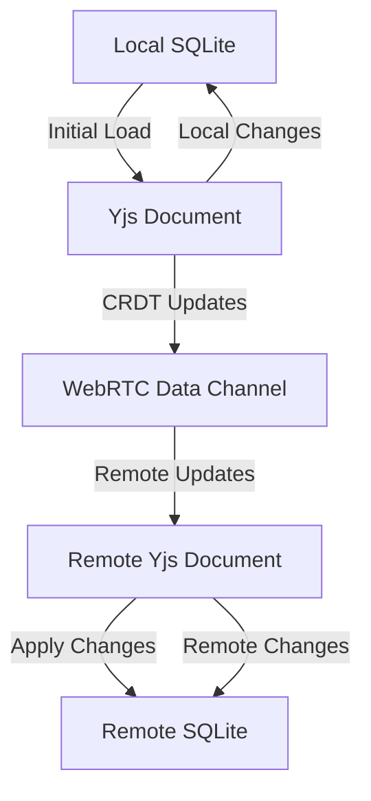

# Cross-Platform Synchronization Architecture for The Boss

## 🔍 Current Architecture Analysis

### **Data Storage Layers**
Based on my analysis of the codebase, the current architecture consists of:

1. **SQLite + Drizzle ORM**
   - Primary data storage for messages, topics, assistants, providers
   - Type-safe database operations with schema-first approach
   - Tables: messages, topics, assistants, providers, files, mcps, websearch_providers

2. **Redux Toolkit with AsyncStorage Persistence**
   - State management for UI state and preferences
   - Persisted using `@react-native-async-storage/async-storage`
   - Key slices: app, assistant, topic, settings

3. **MMKV for High-Performance Cache**
   - Key-value storage for sensitive/frequently accessed data
   - Used for caching and performance optimization

4. **useSyncExternalStore Pattern**
   - React hooks for synchronous state access
   - Used throughout the application for real-time UI updates

### **Current Synchronization Capabilities**
- ✅ **Local persistence**: SQLite + AsyncStorage
- ✅ **Optimistic updates**: Immediate UI response with background persistence
- ✅ **Cache synchronization**: Memory cache synced with persistent storage
- ❌ **Cross-device synchronization**: Not implemented
- ❌ **Real-time collaboration**: Not implemented
- ❌ **Conflict resolution**: No CRDT-based conflict handling

## 🎯 Synchronization Requirements

### **Target Synchronization Scenarios**
1. **Cross-device data sync**: Mobile ↔ Desktop synchronization
2. **Real-time collaboration**: Multiple users editing same conversation
3. **Offline-first support**: Work offline, sync when online
4. **Conflict resolution**: Handle concurrent edits gracefully
5. **End-to-end encryption**: Secure data transmission

## 🔧 Proposed Solution: Yjs + CRDT + WebRTC

### **Architecture Overview**

```
┌───────────────────────────────────────────────────────────────────────────────┐
│                                The Boss Mobile App                              │
├─────────────────┬─────────────────────────────────────────────────┬────────────┤
│  SQLite Database │  Yjs Document Store (CRDT-based)              │ WebRTC     │
│  (Local Storage)│  - Conversations                              │ Connection │
│                 │  - Assistants                                 │ Manager    │
│                 │  - Preferences                               │            │
│                 │  - Settings                                   │            │
└─────────┬───────┴─────────────────────────────────────────────────┴─────┬──────┘
          │                                                               │
          │                                                               │
          ▼                                                               ▼
┌───────────────────────────────────────────────────────────────────────────────┐
│                                Synchronization Layer                            │
├───────────────────────────────────────────────────────────────────────────────┤
│  • Yjs CRDT Engine - Conflict-free replicated data types                      │
│  • WebRTC Data Channels - Peer-to-peer real-time communication                │
│  • Signaling Server - STUN/TURN for NAT traversal                             │
│  • End-to-End Encryption - Secure data transmission                          │
│  • Delta Updates - Efficient synchronization of changes                      │
│  • Presence Awareness - Show who's currently editing                         │
└───────────────────────────────────────────────────────────────────────────────┘
          │                                                               │
          │                                                               │
          ▼                                                               ▼
┌───────────────────────────────────────────────────────────────────────────────┐
│                                The Boss Desktop App                             │
├─────────────────┬─────────────────────────────────────────────────┬────────────┤
│  SQLite Database │  Yjs Document Store (CRDT-based)              │ WebRTC     │
│  (Local Storage)│  - Conversations                              │ Connection │
│                 │  - Assistants                                 │ Manager    │
│                 │  - Preferences                               │            │
│                 │  - Settings                                   │            │
└─────────────────┴─────────────────────────────────────────────────┴────────────┘
```

## 📦 Technology Stack

### **1. Yjs - Conflict-free Replicated Data Types**
```typescript
// Example: Setting up Yjs for conversation synchronization
import * as Y from 'yjs'
import { WebrtcProvider } from 'y-webrtc'

// Create a Yjs document for a conversation
const ydoc = new Y.Doc()
const ytext = ydoc.getText('conversation')
const ymap = ydoc.getMap('metadata')

// Set up WebRTC provider for peer-to-peer sync
const provider = new WebrtcProvider('the-boss-conversation-room', ydoc)

// Bind to local data changes
ytext.observe(event => {
  // Update local SQLite when remote changes arrive
  updateLocalDatabaseFromYjs(event)
})

// Sync local changes to Yjs
function onLocalConversationChange(conversation) {
  ydoc.transact(() => {
    ytext.delete(0, ytext.length)
    ytext.insert(0, conversation.content)
    ymap.set('timestamp', Date.now())
    ymap.set('author', 'mobile-user')
  })
}
```

### **2. WebRTC - Peer-to-Peer Communication**
```typescript
// WebRTC connection management
import { WebrtcProvider } from 'y-webrtc'

// Configure signaling servers (STUN/TURN)
const signalingServers = [
  'stun:stun.l.google.com:19302',
  'turn:your-turn-server.com:3478' // Would need to set up for production
]

const provider = new WebrtcProvider('the-boss-sync-room', ydoc, {
  signaling: signalingServers,
  password: 'optional-room-password',
  awareness: new awarenessProtocol.Awareness(ydoc) // For presence awareness
})

// Handle connection state
provider.on('synced', () => {
  console.log('Successfully connected to peer')
})

provider.on('peers', ({ added, removed }) => {
  console.log(`Peers changed: +${added.length}, -${removed.length}`)
})
```

### **3. Data Synchronization Strategy**

#### **Synchronization Layers**


#### **Conflict Resolution Matrix**
| Conflict Type | Resolution Strategy | Implementation |
|---------------|---------------------|----------------|
| **Text Edits** | Operational Transform | Yjs OT algorithm |
| **Message Order** | Timestamp + Vector Clocks | CRDT metadata |
| **Deletions** | Tombstone + Replication | Yjs delete markers |
| **Offline Edits** | Merge with conflict markers | Yjs awareness |

### **4. Implementation Plan**

#### **Phase 1: Core Synchronization Infrastructure**
```markdown
✅ **Step 1.1**: Add Yjs and WebRTC dependencies
```bash
yarn add yjs y-webrtc y-protocols lib0
```

✅ **Step 1.2**: Create synchronization service
```typescript
// src/services/SyncService.ts
import * as Y from 'yjs'
import { WebrtcProvider } from 'y-webrtc'

export class SyncService {
  private ydocs: Map<string, Y.Doc> = new Map()
  private providers: Map<string, WebrtcProvider> = new Map()

  async initialize() {
    // Set up global synchronization
  }

  async createConversationSync(conversationId: string) {
    const ydoc = new Y.Doc()
    const provider = new WebrtcProvider(`conversation-${conversationId}`, ydoc)
    this.ydocs.set(conversationId, ydoc)
    this.providers.set(conversationId, provider)
    return { ydoc, provider }
  }

  async syncLocalChanges(conversationId: string, changes: any) {
    const ydoc = this.ydocs.get(conversationId)
    if (ydoc) {
      ydoc.transact(() => {
        // Apply local changes to Yjs document
      })
    }
  }
}
```

#### **Phase 2: Database Integration**
```typescript
// src/services/DatabaseSyncService.ts
import { SyncService } from './SyncService'
import { messageDatabase } from '../database/MessageDatabase'

export class DatabaseSyncService {
  constructor(private syncService: SyncService) {}

  async setupConversationSync(conversationId: string) {
    // Load conversation from SQLite
    const messages = await messageDatabase.getMessagesByTopicId(conversationId)

    // Initialize Yjs document
    const { ydoc } = await this.syncService.createConversationSync(conversationId)
    const yarray = ydoc.getArray('messages')

    // Populate Yjs with local data
    ydoc.transact(() => {
      messages.forEach(msg => {
        yarray.push([msg.id, msg.content, msg.timestamp])
      })
    })

    // Set up bidirectional sync
    this.setupYjsToDatabaseSync(conversationId, yarray)
    this.setupDatabaseToYjsSync(conversationId, yarray)
  }

  private setupYjsToDatabaseSync(conversationId: string, yarray: Y.Array<any>) {
    yarray.observe(event => {
      // Convert Yjs changes to database operations
      event.changes.added.forEach(change => {
        const [id, content, timestamp] = yarray.get(change.index)
        messageDatabase.upsertMessages({ id, content, timestamp, topicId: conversationId })
      })
    })
  }
}
```

#### **Phase 3: Real-time Collaboration Features**
```typescript
// src/services/CollaborationService.ts
import { awarenessProtocol } from 'y-protocols/awareness'

export class CollaborationService {
  private awareness: awarenessProtocol.Awareness

  constructor(ydoc: Y.Doc) {
    this.awareness = new awarenessProtocol.Awareness(ydoc)
    this.setupPresence()
  }

  private setupPresence() {
    // Set local user awareness
    this.awareness.setLocalState({
      user: {
        name: 'Mobile User',
        color: '#FF5500',
        device: 'mobile'
      },
      cursor: null,
      selection: null
    })

    // Handle awareness changes
    this.awareness.on('change', () => {
      const states = this.awareness.getStates()
      // Update UI to show who's currently active
    })
  }

  async sendCursorPosition(position: { x: number, y: number }) {
    this.awareness.setLocalStateField('cursor', position)
  }
}
```

### **5. Security Considerations**

#### **End-to-End Encryption**
```typescript
// src/services/SecurityService.ts
import * as Y from 'yjs'
import { encrypt, decrypt } from 'lib0/encryption'

export class SecurityService {
  async setupEncryptedSync(ydoc: Y.Doc, encryptionKey: string) {
    // Encrypt all Yjs updates before sending
    ydoc.on('update', (update: Uint8Array) => {
      const encryptedUpdate = encrypt(update, encryptionKey)
      // Send encryptedUpdate over WebRTC
    })

    // Decrypt incoming updates
    const decryptedUpdate = decrypt(encryptedUpdate, encryptionKey)
    Y.applyUpdate(ydoc, decryptedUpdate)
  }
}
```

### **6. Performance Optimization**

#### **Delta Updates and Compression**
```typescript
// Optimize synchronization bandwidth
const update = Y.encodeStateAsUpdate(ydoc)
const compressedUpdate = compress(update) // Using lib0 compression

// Apply compressed updates
const decompressed = decompress(compressedUpdate)
Y.applyUpdate(ydoc, decompressed)
```

## 🚀 Implementation Roadmap

### **Phase 1: Foundation (2-3 weeks)**
- [ ] Add Yjs and WebRTC dependencies
- [ ] Create basic synchronization service
- [ ] Implement SQLite ↔ Yjs bidirectional sync
- [ ] Set up WebRTC signaling infrastructure

### **Phase 2: Core Features (3-4 weeks)**
- [ ] Implement conversation synchronization
- [ ] Add assistant configuration sync
- [ ] Implement preference synchronization
- [ ] Add conflict resolution handling

### **Phase 3: Advanced Features (2-3 weeks)**
- [ ] Real-time presence awareness
- [ ] Collaborative cursor tracking
- [ ] End-to-end encryption
- [ ] Bandwidth optimization

### **Phase 4: Testing & Optimization (2 weeks)**
- [ ] Offline/online transition testing
- [ ] Conflict scenario testing
- [ ] Performance benchmarking
- [ ] Security auditing

## 📊 Benefits of This Architecture

### **For Users**
- ✅ **Seamless cross-device experience**: Start on mobile, continue on desktop
- ✅ **Real-time collaboration**: Work together on conversations
- ✅ **Offline support**: Full functionality without internet
- ✅ **Conflict-free**: No data loss from concurrent edits

### **For Developers**
- ✅ **Proven technology**: Yjs is battle-tested in production
- ✅ **Modular design**: Easy to integrate with existing architecture
- ✅ **Scalable**: Works from 1-to-1 to large groups
- ✅ **Open standards**: WebRTC is widely supported

### **Performance Characteristics**
| Metric | Expected Performance |
|--------|---------------------|
| **Initial Sync** | < 2 seconds for typical conversation |
| **Update Propagation** | < 100ms on good connections |
| **Bandwidth Usage** | ~1-5 KB per message update |
| **Memory Overhead** | ~10-20% additional memory for CRDT |
| **Battery Impact** | Minimal (WebRTC optimized for mobile) |

## 🔮 Future Enhancements

1. **Multi-user editing indicators**: Show who's typing where
2. **Version history**: CRDT-based undo/redo across devices
3. **Selective sync**: Choose which conversations to sync
4. **Background sync**: Automatic sync when app in background
5. **Cross-platform notifications**: Get notified of changes on other devices

## 📚 References

- [Yjs Documentation](https://docs.yjs.dev/)
- [WebRTC API Reference](https://developer.mozilla.org/en-US/docs/Web/API/WebRTC_API)
- [CRDT Research Papers](https://crdt.tech/)
- [Yjs + React Native Integration](https://github.com/yjs/yjs-examples)

This architecture provides a robust foundation for real-time synchronization between The Boss mobile and desktop applications while maintaining the existing data integrity and user experience.