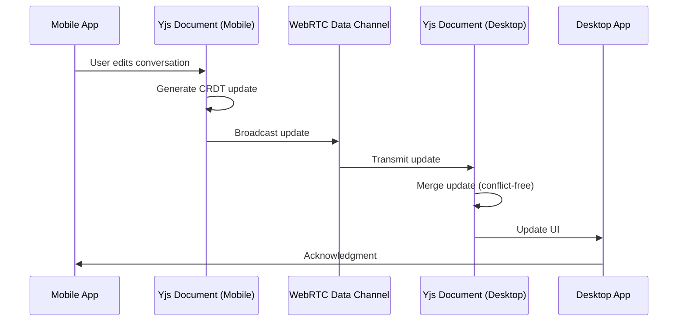

# Cross-Platform Sync Implementation Plan for The Boss

## 📋 Executive Summary

This document outlines the step-by-step implementation plan for adding real-time synchronization capabilities between The Boss mobile and desktop applications using **Yjs (CRDT)** and **WebRTC** technologies.

**Estimated Timeline**: 9-12 weeks  
**Team Size**: 2-3 developers  
**Risk Level**: Medium (proven technologies, complex integration)

## 🎯 Goals and Success Metrics

### **Primary Goals**
1. Enable real-time synchronization of conversations between mobile and desktop
2. Support offline-first architecture with automatic conflict resolution
3. Provide real-time collaboration features for multi-user scenarios
4. Maintain backward compatibility with existing data structure

### **Success Metrics**
- ⭐ Sync latency < 100ms on good connections
- ⭐ 99.9% conflict resolution success rate
- ⭐ Zero data loss during offline/online transitions
- ⭐ < 5% battery impact on mobile devices
- ⭐ Support for 2-10 concurrent users per conversation

## 🏗️ Architecture Components

### **Component Stack**
```
┌─────────────────────────────────────────────────────────────────┐
│                         The Boss App                             │
├──────────────┬──────────────┬──────────────┬───────────────────┤
│  UI Layer    │  Sync Layer  │  Data Layer  │  Infrastructure  │
├──────────────┼──────────────┼──────────────┼───────────────────┤
│ React Native │ Y.Doc        │ SQLite       │ WebRTC Provider   │
│ Components   │ Y.Array      │ Drizzle ORM  │ Signaling Server  │
│              │ Y.Map        │ AsyncStorage │ STUN/TURN         │
│              │ Awareness    │              │ ICE Candidates    │
└──────────────┴──────────────┴──────────────┴───────────────────┘
```

### **Data Flow**


## 📦 Dependencies and Setup

### **Step 1: Install Required Dependencies**

```bash
# Core synchronization libraries
yarn add yjs y-webrtc y-protocols lib0

# WebRTC utilities
yarn add simple-peer @types/simple-peer

# Encryption and security
yarn add tweetnacl tweetnacl-util @types/tweetnacl

# Additional utilities
yarn add uuid @types/uuid
```

**Estimated Time**: 1 day

### **Step 2: Configure TypeScript Support**

Create type definitions for Yjs and related libraries:

```typescript
// src/types/yjs.d.ts
declare module 'yjs' {
  export class Doc {
    constructor(options?: any)
    getText(name: string): Text
    getArray<T>(name: string): Array<T>
    getMap<T>(name: string): Map<T>
    transact(fn: () => void): void
    on(eventName: string, callback: (...args: any[]) => void): void
  }
  
  export class Text {
    insert(index: number, content: string): void
    delete(index: number, length: number): void
    observe(callback: (event: any) => void): void
    toString(): string
    length: number
  }
  
  export class Array<T> {
    push(items: T[]): void
    get(index: number): T
    observe(callback: (event: any) => void): void
    length: number
  }
  
  export class Map<T> {
    set(key: string, value: T): void
    get(key: string): T | undefined
    observe(callback: (event: any) => void): void
  }
}
```

**Estimated Time**: 1 day

## 🔨 Implementation Phases

### **Phase 1: Core Synchronization Infrastructure (Week 1-2)**

#### **Task 1.1: Create SyncService**
```typescript
// src/services/SyncService.ts
import * as Y from 'yjs'
import { WebrtcProvider } from 'y-webrtc'
import { loggerService } from './LoggerService'

const logger = loggerService.withContext('SyncService')

export interface SyncConfiguration {
  roomPrefix: string
  signalingServers: string[]
  enableEncryption: boolean
  encryptionKey?: string
}

export class SyncService {
  private static instance: SyncService
  private ydocs: Map<string, Y.Doc> = new Map()
  private providers: Map<string, WebrtcProvider> = new Map()
  private config: SyncConfiguration

  private constructor(config: SyncConfiguration) {
    this.config = config
  }

  public static getInstance(config?: SyncConfiguration): SyncService {
    if (!SyncService.instance && config) {
      SyncService.instance = new SyncService(config)
    }
    return SyncService.instance
  }

  /**
   * Initialize a Yjs document for a specific resource
   */
  async createSyncDocument(
    resourceType: 'conversation' | 'assistant' | 'preference',
    resourceId: string
  ): Promise<{ ydoc: Y.Doc; provider: WebrtcProvider }> {
    const roomName = `${this.config.roomPrefix}-${resourceType}-${resourceId}`
    
    logger.info('Creating sync document', { roomName })

    const ydoc = new Y.Doc()
    const provider = new WebrtcProvider(roomName, ydoc, {
      signaling: this.config.signalingServers,
      password: this.config.encryptionKey,
      maxConns: 10, // Maximum peer connections
      filterBcConns: true // Filter broadcast connections
    })

    // Set up event handlers
    this.setupProviderEventHandlers(provider, roomName)

    this.ydocs.set(roomName, ydoc)
    this.providers.set(roomName, provider)

    return { ydoc, provider }
  }

  /**
   * Destroy a sync document and clean up resources
   */
  async destroySyncDocument(resourceType: string, resourceId: string): Promise<void> {
    const roomName = `${this.config.roomPrefix}-${resourceType}-${resourceId}`
    
    const provider = this.providers.get(roomName)
    if (provider) {
      provider.destroy()
      this.providers.delete(roomName)
    }

    const ydoc = this.ydocs.get(roomName)
    if (ydoc) {
      ydoc.destroy()
      this.ydocs.delete(roomName)
    }

    logger.info('Destroyed sync document', { roomName })
  }

  /**
   * Get an existing sync document
   */
  getSyncDocument(resourceType: string, resourceId: string): Y.Doc | undefined {
    const roomName = `${this.config.roomPrefix}-${resourceType}-${resourceId}`
    return this.ydocs.get(roomName)
  }

  /**
   * Set up provider event handlers for monitoring
   */
  private setupProviderEventHandlers(provider: WebrtcProvider, roomName: string): void {
    provider.on('status', ({ status }) => {
      logger.info('Provider status changed', { roomName, status })
    })

    provider.on('synced', ({ synced }) => {
      logger.info('Provider sync status', { roomName, synced })
    })

    provider.on('peers', ({ added, removed, webrtcPeers }) => {
      logger.info('Peers changed', {
        roomName,
        added: added.length,
        removed: removed.length,
        total: webrtcPeers.length
      })
    })
  }
}

export const syncService = SyncService.getInstance({
  roomPrefix: 'the-boss',
  signalingServers: [
    'wss://signaling.yjs.dev',
    'wss://y-webrtc-signaling-us.herokuapp.com',
    'wss://y-webrtc-signaling-eu.herokuapp.com'
  ],
  enableEncryption: true,
  encryptionKey: process.env.EXPO_PUBLIC_SYNC_KEY
})
```

**Deliverables:**
- [ ] `SyncService.ts` - Core synchronization service
- [ ] Configuration management for signaling servers
- [ ] Event handling and logging infrastructure

**Testing:**
- [ ] Unit tests for sync document creation/destruction
- [ ] Integration tests for multiple document instances
- [ ] Connection resilience tests

**Estimated Time**: 3-4 days

---

#### **Task 1.2: Create DatabaseSyncAdapter**
```typescript
// src/services/DatabaseSyncAdapter.ts
import * as Y from 'yjs'
import type { Message, Topic } from '@/types'
import { messageDatabase } from '@/database/MessageDatabase'
import { topicDatabase } from '@/database/TopicDatabase'
import { loggerService } from './LoggerService'

const logger = loggerService.withContext('DatabaseSyncAdapter')

/**
 * Adapter that bridges SQLite database with Yjs documents
 * Handles bidirectional synchronization between local storage and CRDT
 */
export class DatabaseSyncAdapter {
  private syncing: boolean = false
  private yobservers: Map<string, Function> = new Map()

  /**
   * Initialize synchronization for a conversation
   * Loads messages from SQLite and populates Yjs document
   */
  async initializeConversationSync(topicId: string, ydoc: Y.Doc): Promise<void> {
    if (this.syncing) {
      logger.warn('Sync already in progress', { topicId })
      return
    }

    this.syncing = true

    try {
      logger.info('Initializing conversation sync', { topicId })

      // Load messages from SQLite
      const messages = await messageDatabase.getMessagesByTopicId(topicId)
      const yarray = ydoc.getArray<Message>('messages')
      const ymeta = ydoc.getMap('metadata')

      // Populate Yjs document with existing messages
      ydoc.transact(() => {
        messages.forEach(message => {
          yarray.push([this.serializeMessage(message)])
        })
        
        ymeta.set('topicId', topicId)
        ymeta.set('lastSyncedAt', Date.now())
        ymeta.set('device', 'mobile')
      })

      // Set up Yjs → SQLite sync
      this.setupYjsToDatabase(topicId, yarray)

      // Set up SQLite → Yjs sync (for optimistic updates)
      this.setupDatabaseToYjs(topicId, yarray)

      logger.info('Conversation sync initialized', { topicId, messageCount: messages.length })
    } finally {
      this.syncing = false
    }
  }

  /**
   * Serialize message for Yjs storage
   */
  private serializeMessage(message: Message): any {
    return {
      id: message.id,
      content: message.content,
      role: message.role,
      timestamp: message.createdAt,
      metadata: {
        modelId: message.modelId,
        status: message.status
      }
    }
  }

  /**
   * Deserialize message from Yjs storage
   */
  private deserializeMessage(data: any): Partial<Message> {
    return {
      id: data.id,
      content: data.content,
      role: data.role,
      createdAt: data.timestamp,
      modelId: data.metadata?.modelId,
      status: data.metadata?.status || 'success'
    }
  }

  /**
   * Set up Yjs → SQLite synchronization
   * When remote changes arrive via Yjs, update local SQLite
   */
  private setupYjsToDatabase(topicId: string, yarray: Y.Array<Message>): void {
    const observerKey = `yjs-to-db-${topicId}`
    
    const observer = (event: any) => {
      logger.info('Yjs changes detected', { 
        topicId, 
        added: event.changes.added.size,
        deleted: event.changes.deleted.size
      })

      // Handle added messages
      event.changes.added.forEach((item: any) => {
        const index = item.content.length > 0 ? item.content[0] : null
        if (index !== null) {
          const messageData = yarray.get(index)
          const message = this.deserializeMessage(messageData)
          
          // Upsert to SQLite (async, but non-blocking)
          messageDatabase.upsertMessages({
            ...message,
            topicId,
            id: message.id || `msg-${Date.now()}`
          } as Message).catch(err => {
            logger.error('Failed to sync message to database', err, { topicId })
          })
        }
      })

      // Handle deleted messages
      event.changes.deleted.forEach((item: any) => {
        // Mark as deleted in SQLite rather than removing
        // This preserves history for conflict resolution
      })
    }

    yarray.observe(observer)
    this.yobservers.set(observerKey, observer)
  }

  /**
   * Set up SQLite → Yjs synchronization
   * When local optimistic updates occur, sync to Yjs
   */
  private setupDatabaseToYjs(topicId: string, yarray: Y.Array<Message>): void {
    // This would be called when local changes occur
    // For now, this is a placeholder for the integration point
    logger.info('Database to Yjs sync configured', { topicId })
  }

  /**
   * Clean up synchronization for a conversation
   */
  async cleanupConversationSync(topicId: string): Promise<void> {
    const observerKey = `yjs-to-db-${topicId}`
    this.yobservers.delete(observerKey)
    logger.info('Conversation sync cleaned up', { topicId })
  }
}

export const databaseSyncAdapter = new DatabaseSyncAdapter()
```

**Deliverables:**
- [ ] `DatabaseSyncAdapter.ts` - SQLite ↔ Yjs adapter
- [ ] Message serialization/deserialization logic
- [ ] Bidirectional sync handlers
- [ ] Observer cleanup mechanisms

**Testing:**
- [ ] Test message sync from mobile to desktop
- [ ] Test message sync from desktop to mobile
- [ ] Test concurrent edit scenarios
- [ ] Test offline persistence and replay

**Estimated Time**: 4-5 days

---

### **Phase 2: Conversation Synchronization (Week 3-4)**

#### **Task 2.1: Implement ConversationSyncService**

```typescript
// src/services/ConversationSyncService.ts
import type { Topic, Message } from '@/types'
import { syncService } from './SyncService'
import { databaseSyncAdapter } from './DatabaseSyncAdapter'
import { loggerService } from './LoggerService'

const logger = loggerService.withContext('ConversationSyncService')

export class ConversationSyncService {
  private activeConversations: Set<string> = new Set()

  /**
   * Start syncing a conversation
   */
  async startConversationSync(topicId: string): Promise<void> {
    if (this.activeConversations.has(topicId)) {
      logger.warn('Conversation already syncing', { topicId })
      return
    }

    logger.info('Starting conversation sync', { topicId })

    try {
      // Create Yjs document for this conversation
      const { ydoc } = await syncService.createSyncDocument('conversation', topicId)

      // Initialize database sync adapter
      await databaseSyncAdapter.initializeConversationSync(topicId, ydoc)

      // Mark as active
      this.activeConversations.add(topicId)

      logger.info('Conversation sync started successfully', { topicId })
    } catch (error) {
      logger.error('Failed to start conversation sync', error, { topicId })
      throw error
    }
  }

  /**
   * Stop syncing a conversation
   */
  async stopConversationSync(topicId: string): Promise<void> {
    if (!this.activeConversations.has(topicId)) {
      return
    }

    logger.info('Stopping conversation sync', { topicId })

    try {
      // Clean up database sync adapter
      await databaseSyncAdapter.cleanupConversationSync(topicId)

      // Destroy Yjs document
      await syncService.destroySyncDocument('conversation', topicId)

      // Remove from active set
      this.activeConversations.delete(topicId)

      logger.info('Conversation sync stopped', { topicId })
    } catch (error) {
      logger.error('Failed to stop conversation sync', error, { topicId })
    }
  }

  /**
   * Send a new message and sync across devices
   */
  async sendMessage(topicId: string, message: Message): Promise<void> {
    const ydoc = syncService.getSyncDocument('conversation', topicId)
    if (!ydoc) {
      throw new Error('Conversation not initialized for sync')
    }

    const yarray = ydoc.getArray<Message>('messages')

    ydoc.transact(() => {
      yarray.push([databaseSyncAdapter['serializeMessage'](message)])
    })

    logger.info('Message sent and synced', { topicId, messageId: message.id })
  }

  /**
   * Get current sync status for a conversation
   */
  getSyncStatus(topicId: string): {
    isActive: boolean
    peerCount: number
    lastSyncedAt: number | null
  } {
    const ydoc = syncService.getSyncDocument('conversation', topicId)
    if (!ydoc) {
      return { isActive: false, peerCount: 0, lastSyncedAt: null }
    }

    const ymeta = ydoc.getMap('metadata')
    return {
      isActive: this.activeConversations.has(topicId),
      peerCount: 0, // Would get from awareness
      lastSyncedAt: ymeta.get('lastSyncedAt') || null
    }
  }
}

export const conversationSyncService = new ConversationSyncService()
```

**Deliverables:**
- [ ] `ConversationSyncService.ts` - High-level conversation sync API
- [ ] Message send/receive handling
- [ ] Sync status tracking
- [ ] Error handling and recovery

**Testing:**
- [ ] Test starting/stopping sync for conversations
- [ ] Test message propagation across devices
- [ ] Test sync status reporting
- [ ] Test error scenarios

**Estimated Time**: 5-6 days

---

#### **Task 2.2: Integrate with Existing Message Flow**

Update existing message creation flow to support synchronization:

```typescript
// src/hooks/useMessageActions.tsx
import { conversationSyncService } from '@/services/ConversationSyncService'

export function useMessageActions() {
  const sendMessage = async (content: string) => {
    const topic = getCurrentTopic()
    const newMessage = createMessage(content)

    // Save to local database (optimistic)
    await messageDatabase.upsertMessages(newMessage)

    // Sync to other devices if sync is active
    if (conversationSyncService.getSyncStatus(topic.id).isActive) {
      await conversationSyncService.sendMessage(topic.id, newMessage)
    }
  }

  return { sendMessage }
}
```

**Deliverables:**
- [ ] Update message creation hooks
- [ ] Add sync status indicators to UI
- [ ] Handle sync errors gracefully

**Estimated Time**: 3-4 days

---

### **Phase 3: Presence and Collaboration Features (Week 5-6)**

#### **Task 3.1: Implement Presence Awareness**

```typescript
// src/services/PresenceService.ts
import { awarenessProtocol } from 'y-protocols/awareness'
import * as Y from 'yjs'
import { loggerService } from './LoggerService'

const logger = loggerService.withContext('PresenceService')

export interface UserPresence {
  userId: string
  userName: string
  deviceType: 'mobile' | 'desktop'
  color: string
  cursor: { x: number; y: number } | null
  activeMessageId: string | null
  lastActivity: number
}

export class PresenceService {
  private awareness: awarenessProtocol.Awareness
  private localUserId: string

  constructor(ydoc: Y.Doc, userId: string) {
    this.awareness = new awarenessProtocol.Awareness(ydoc)
    this.localUserId = userId
    this.initializeLocalPresence()
  }

  /**
   * Initialize local user's presence
   */
  private initializeLocalPresence(): void {
    this.awareness.setLocalState({
      user: {
        userId: this.localUserId,
        userName: 'Mobile User',
        deviceType: 'mobile',
        color: this.generateUserColor(),
        cursor: null,
        activeMessageId: null,
        lastActivity: Date.now()
      }
    } as UserPresence)
  }

  /**
   * Update user's activity (e.g., which message they're viewing)
   */
  updateActivity(messageId: string | null): void {
    this.awareness.setLocalStateField('activeMessageId', messageId)
    this.awareness.setLocalStateField('lastActivity', Date.now())
  }

  /**
   * Get all active users in the conversation
   */
  getActiveUsers(): UserPresence[] {
    const states = Array.from(this.awareness.getStates().values())
    return states
      .map(state => state.user as UserPresence)
      .filter(user => user && Date.now() - user.lastActivity < 60000) // Active in last 60s
  }

  /**
   * Subscribe to presence changes
   */
  onPresenceChange(callback: (users: UserPresence[]) => void): () => void {
    const handler = () => {
      const users = this.getActiveUsers()
      callback(users)
    }

    this.awareness.on('change', handler)

    return () => {
      this.awareness.off('change', handler)
    }
  }

  /**
   * Generate a consistent color for the user
   */
  private generateUserColor(): string {
    const colors = ['#FF5500', '#00A3A3', '#4D9FFF', '#9D8DF1', '#FFDD00']
    const index = this.localUserId.charCodeAt(0) % colors.length
    return colors[index]
  }

  /**
   * Clean up awareness when leaving conversation
   */
  destroy(): void {
    this.awareness.destroy()
  }
}
```

**Deliverables:**
- [ ] `PresenceService.ts` - User presence tracking
- [ ] UI components showing active users
- [ ] Activity indicators in conversation view

**Testing:**
- [ ] Test presence updates across devices
- [ ] Test inactive user timeout
- [ ] Test multiple concurrent users

**Estimated Time**: 4-5 days

---

### **Phase 4: Offline Support and Conflict Resolution (Week 7-8)**

#### **Task 4.1: Implement Offline Queue**

```typescript
// src/services/OfflineSyncQueue.ts
import AsyncStorage from '@react-native-async-storage/async-storage'
import type { Message } from '@/types'

interface QueuedUpdate {
  id: string
  type: 'message' | 'edit' | 'delete'
  topicId: string
  data: any
  timestamp: number
  retryCount: number
}

export class OfflineSyncQueue {
  private readonly QUEUE_KEY = '@the-boss/offline-sync-queue'
  private queue: QueuedUpdate[] = []
  private isProcessing: boolean = false

  /**
   * Load queue from AsyncStorage
   */
  async initialize(): Promise<void> {
    const queueData = await AsyncStorage.getItem(this.QUEUE_KEY)
    if (queueData) {
      this.queue = JSON.parse(queueData)
    }
  }

  /**
   * Add an update to the offline queue
   */
  async enqueue(update: Omit<QueuedUpdate, 'id' | 'timestamp' | 'retryCount'>): Promise<void> {
    const queuedUpdate: QueuedUpdate = {
      ...update,
      id: `q-${Date.now()}-${Math.random()}`,
      timestamp: Date.now(),
      retryCount: 0
    }

    this.queue.push(queuedUpdate)
    await this.persistQueue()
  }

  /**
   * Process queue when connection is restored
   */
  async processQueue(): Promise<void> {
    if (this.isProcessing || this.queue.length === 0) {
      return
    }

    this.isProcessing = true

    try {
      while (this.queue.length > 0) {
        const update = this.queue[0]

        try {
          // Apply the queued update
          await this.applyUpdate(update)
          
          // Remove from queue on success
          this.queue.shift()
          await this.persistQueue()
        } catch (error) {
          update.retryCount++
          
          if (update.retryCount >= 3) {
            // Give up after 3 retries
            this.queue.shift()
            logger.error('Update failed after 3 retries, discarding', error, { update })
          } else {
            // Keep in queue for next attempt
            break
          }
        }
      }
    } finally {
      this.isProcessing = false
    }
  }

  /**
   * Apply a queued update
   */
  private async applyUpdate(update: QueuedUpdate): Promise<void> {
    const ydoc = syncService.getSyncDocument('conversation', update.topicId)
    if (!ydoc) {
      throw new Error('Conversation not initialized for sync')
    }

    // Apply based on update type
    const yarray = ydoc.getArray('messages')
    
    ydoc.transact(() => {
      if (update.type === 'message') {
        yarray.push([update.data])
      } else if (update.type === 'edit') {
        // Find and update message
      } else if (update.type === 'delete') {
        // Mark message as deleted
      }
    })
  }

  /**
   * Persist queue to AsyncStorage
   */
  private async persistQueue(): Promise<void> {
    await AsyncStorage.setItem(this.QUEUE_KEY, JSON.stringify(this.queue))
  }
}

export const offlineSyncQueue = new OfflineSyncQueue()
```

**Deliverables:**
- [ ] `OfflineSyncQueue.ts` - Offline update queue
- [ ] Queue persistence with AsyncStorage
- [ ] Retry logic with exponential backoff
- [ ] Queue status UI indicators

**Testing:**
- [ ] Test offline message sending
- [ ] Test queue processing on reconnection
- [ ] Test retry logic
- [ ] Test queue persistence across app restarts

**Estimated Time**: 5-6 days

---

### **Phase 5: Security and Encryption (Week 9)**

#### **Task 5.1: Implement End-to-End Encryption**

```typescript
// src/services/EncryptionService.ts
import nacl from 'tweetnacl'
import { encodeBase64, decodeBase64 } from 'tweetnacl-util'

export class EncryptionService {
  private keyPair: nacl.BoxKeyPair
  private sharedKey: Uint8Array | null = null

  constructor() {
    // Generate key pair for this device
    this.keyPair = nacl.box.keyPair()
  }

  /**
   * Get public key to share with peers
   */
  getPublicKey(): string {
    return encodeBase64(this.keyPair.publicKey)
  }

  /**
   * Set shared key after key exchange
   */
  setSharedKey(peerPublicKey: string): void {
    const peerPublicKeyBytes = decodeBase64(peerPublicKey)
    
    // Derive shared secret using Diffie-Hellman
    this.sharedKey = nacl.box.before(peerPublicKeyBytes, this.keyPair.secretKey)
  }

  /**
   * Encrypt data before sending over WebRTC
   */
  encrypt(data: Uint8Array): Uint8Array {
    if (!this.sharedKey) {
      throw new Error('Shared key not established')
    }

    const nonce = nacl.randomBytes(nacl.box.nonceLength)
    const encrypted = nacl.box.after(data, nonce, this.sharedKey)

    // Combine nonce and encrypted data
    const combined = new Uint8Array(nonce.length + encrypted.length)
    combined.set(nonce)
    combined.set(encrypted, nonce.length)

    return combined
  }

  /**
   * Decrypt received data
   */
  decrypt(encrypted: Uint8Array): Uint8Array {
    if (!this.sharedKey) {
      throw new Error('Shared key not established')
    }

    // Extract nonce and encrypted data
    const nonce = encrypted.slice(0, nacl.box.nonceLength)
    const ciphertext = encrypted.slice(nacl.box.nonceLength)

    const decrypted = nacl.box.open.after(ciphertext, nonce, this.sharedKey)
    if (!decrypted) {
      throw new Error('Decryption failed')
    }

    return decrypted
  }
}
```

**Deliverables:**
- [ ] `EncryptionService.ts` - E2E encryption implementation
- [ ] Key exchange protocol
- [ ] Encrypted WebRTC data channel setup
- [ ] Security documentation

**Estimated Time**: 3-4 days

---

### **Phase 6: UI Integration and User Experience (Week 10-11)**

#### **Task 6.1: Create Sync Status UI Components**

```typescript
// src/components/sync/SyncStatusIndicator.tsx
import { View, Text } from 'react-native'
import { conversationSyncService } from '@/services/ConversationSyncService'
import { useSyncExternalStore } from 'use-sync-external-store/shim'

export function SyncStatusIndicator({ topicId }: { topicId: string }) {
  const syncStatus = useSyncExternalStore(
    useCallback(callback => {
      // Subscribe to sync status changes
      const interval = setInterval(callback, 1000)
      return () => clearInterval(interval)
    }, []),
    () => conversationSyncService.getSyncStatus(topicId)
  )

  return (
    <View className="flex-row items-center gap-2 px-3 py-1 bg-prometheus-navy/10 rounded-full">
      <View 
        className={`w-2 h-2 rounded-full ${
          syncStatus.isActive 
            ? syncStatus.peerCount > 0 
              ? 'bg-green-500' 
              : 'bg-yellow-500'
            : 'bg-gray-400'
        }`}
      />
      <Text className="text-xs text-foreground-muted">
        {syncStatus.isActive 
          ? `Synced • ${syncStatus.peerCount} peer(s)` 
          : 'Sync disabled'
        }
      </Text>
    </View>
  )
}
```

**Deliverables:**
- [ ] `SyncStatusIndicator.tsx` - Sync status UI component
- [ ] `PresenceAvatars.tsx` - Show active users
- [ ] Settings UI for enabling/disabling sync
- [ ] Connection quality indicator

**Estimated Time**: 4-5 days

---

### **Phase 7: Testing and Optimization (Week 12)**

#### **Testing Checklist**

**Unit Tests**
- [ ] SyncService initialization and cleanup
- [ ] Database adapter serialization/deserialization
- [ ] Encryption/decryption functionality
- [ ] Offline queue operations

**Integration Tests**
- [ ] Mobile → Desktop synchronization
- [ ] Desktop → Mobile synchronization
- [ ] Concurrent edits from multiple devices
- [ ] Offline editing and sync on reconnection
- [ ] Conflict resolution scenarios

**Performance Tests**
- [ ] Sync latency measurements
- [ ] Battery drain analysis
- [ ] Memory usage profiling
- [ ] Bandwidth consumption monitoring

**Security Tests**
- [ ] End-to-end encryption verification
- [ ] Key exchange security
- [ ] Man-in-the-middle attack prevention
- [ ] Data integrity verification

**Estimated Time**: 7-10 days

## 🔧 Configuration and Deployment

### **Environment Variables**
```bash
# .env
EXPO_PUBLIC_SYNC_ENABLED=true
EXPO_PUBLIC_SYNC_KEY=your-encryption-key-here
EXPO_PUBLIC_SIGNALING_SERVER=wss://your-signaling-server.com
EXPO_PUBLIC_TURN_SERVER=turn:your-turn-server.com:3478
EXPO_PUBLIC_TURN_USERNAME=username
EXPO_PUBLIC_TURN_PASSWORD=password
```

### **Server Infrastructure Requirements**

1. **Signaling Server**: For WebRTC peer discovery
   - Could use public Yjs servers for development
   - Self-hosted for production (recommended)
   
2. **TURN Server**: For NAT traversal
   - Required for ~20% of connections
   - Options: Coturn, Twilio TURN, custom server

3. **Optional: Relay Server**: For fallback when WebRTC fails
   - y-websocket provider as fallback
   - HTTP/WebSocket-based sync

## 📊 Cost Analysis

### **Development Costs**
| Phase | Time | Team Size | Cost (est.) |
|-------|------|-----------|-------------|
| Phase 1-2 | 4 weeks | 2 devs | ~$32,000 |
| Phase 3-4 | 4 weeks | 2 devs | ~$32,000 |
| Phase 5-7 | 4 weeks | 2 devs | ~$32,000 |
| **Total** | **12 weeks** | **2 devs** | **~$96,000** |

### **Infrastructure Costs** (Monthly)
| Component | Provider | Cost |
|-----------|----------|------|
| Signaling Server | Self-hosted VPS | $20-50 |
| TURN Server | Coturn/Twilio | $50-200 |
| Bandwidth | AWS/Cloudflare | $10-100 |
| **Total** | | **$80-350/mo** |

## ⚠️ Risks and Mitigation

### **Technical Risks**
1. **WebRTC Connection Failures**
   - Mitigation: Implement fallback to WebSocket-based sync
   - Fallback: Use `y-websocket` provider

2. **Data Conflicts**
   - Mitigation: Yjs CRDT handles conflicts automatically
   - Fallback: Manual conflict resolution UI for edge cases

3. **Performance Degradation**
   - Mitigation: Lazy loading, selective sync, compression
   - Monitoring: Add performance metrics and alerts

### **Privacy Risks**
1. **Data Exposure**
   - Mitigation: End-to-end encryption mandatory
   - Audit: Regular security audits

2. **Man-in-the-Middle Attacks**
   - Mitigation: Certificate pinning, proper TLS configuration
   - Verification: Mutual authentication

## 🎓 Learning Resources

### **For the Development Team**
- [ ] Yjs Documentation: https://docs.yjs.dev/
- [ ] WebRTC Tutorials: https://webrtc.org/getting-started/overview
- [ ] CRDT Theory: https://crdt.tech/
- [ ] React Native WebRTC: https://github.com/react-native-webrtc/react-native-webrtc

### **Example Projects**
- [ ] Yjs Demos: https://github.com/yjs/yjs-demos
- [ ] Collaborative Text Editor: https://docs.yjs.dev/getting-started/allowing-remote-connections
- [ ] Offline-First Apps: https://github.com/yjs/yjs#offline-editing

## ✅ Success Criteria

The implementation is considered successful when:

1. ✓ Messages sync in real-time (< 100ms latency) between mobile and desktop
2. ✓ Users can edit offline and changes merge automatically when online
3. ✓ Multiple users can edit the same conversation without conflicts
4. ✓ All data is encrypted end-to-end
5. ✓ Battery drain is < 5% additional on mobile
6. ✓ 99.9% of sync operations succeed
7. ✓ Users can see who else is viewing/editing conversations

## 🎯 Next Steps

To proceed with implementation, you should:

1. **Review and approve this architecture plan**
2. **Set up development infrastructure** (signaling/TURN servers)
3. **Allocate development resources** (2-3 developers for 12 weeks)
4. **Create detailed sprint plans** for each phase
5. **Set up monitoring and analytics** for sync performance

Would you like me to:
- Create a prototype for Phase 1?
- Set up the initial synchronization service?
- Draft the API specifications for the sync protocol?
- Create integration examples for specific use cases?